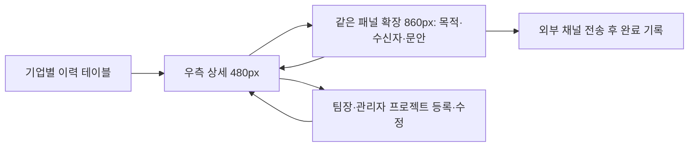

# 연락 이력과 협업 이력 화면 구현

2026-10-03. 프론트엔드 작업 범위. 기준은 UX 정리 대화와 handoff/contact-history-2026-10-03의 여섯 문서다. DB, 백엔드, 운영 데이터 변경은 포함하지 않는다.

## 화면 조건

기존 신규 발굴의 세 패널과 가운데 메시지 작성 구조를 유지한다. 연락 이력과 협업 이력은 기업당 한 행의 테이블을 사용한다. 행 선택은 우측 상세, 메시지 작성은 같은 패널의 확장 모드다. 별도 메시지 페이지나 배정 큐를 만들지 않는다.

Noto Sans KR / Open Sans, 기존 B 팔레트, shadcn 컴포넌트, 공통 layout 토큰을 사용한다. 테스트 조건은 1440×900, 1024×768, 390×844. 사용자 요청에 따라 운영의 연락·협업 이력은 임시 목업을 표시한다. 신규 발굴은 기존 실데이터 연결을 유지한다. 명시적 미연결 저장소는 목업을 사용하지 않는 후속 설정을 위해 유지한다.

## 상태별 작업

| 상태 | 현재 목적과 필요한 정보 | 다음 행동 | 제한 |
|---|---|---|---|
| 현재 작업 없음 | 이전 발송·응답·프로젝트 확인 | 메시지 작성 | 현재 회차 필요 |
| 본인 작성 중 | 목적·수신자·저장 근거 확인 | 생성 또는 이어서 편집 | 목적·유효 수신자·근거 필수 |
| 타인 작성 중 | 담당자와 작업 확인 | 조회 | 변경 불가 |
| 발송 완료 | 당시 문안·분기·발송일·결과 확인 | 이력 조회 | 이번 작업 재발송 불가 |
| 프로젝트 미입력 | 수주 분기와 정보 입력 여부 확인 | 팀장·관리자 등록 | 팀원 등록·수정 불가 |
| 입력 중 | 현재 입력 유지 | 저장·취소 | 전환·닫기로 입력 유실하지 않음 |
| 오류 | 실패한 조회·작업과 기존 입력 확인 | 재시도 | 실패를 성공으로 표시하지 않음 |
| 목업 데이터 | 이력 조회·작성 흐름 확인 | 브라우저에 예시 변경 저장 | 실제 API·AI·발송·DB 쓰기 없음 |
| 명시적 미연결 설정 | 미연결 기능 확인 | 신규 발굴 이동 | 자료·쓰기 행동 미노출 |

## 순서와 완료 기준

- [x] 1. 화면·상태 정의와 데이터 계약 준비
- [x] 2. 세 탭 및 공통 레이아웃
- [x] 3. 연락 이력 검색·필터·테이블·상세
- [x] 4. 기존 제목·본문 편집기 공유, 확장 패널, 목적·수신자·초안 보존
- [x] 5. 협업 이력·프로젝트 등록·수정 UI
- [x] 6. 기능 검사 및 동일 데이터·상태·크기의 시각·흐름 검수

## 연결 범위

HistoryRepository는 조회·작업 시작·목적·수신자·초안·발송·프로젝트 관리의 화면 계약이다. 현재 구현은 개발 예시·운영 임시 목업·명시적 미연결 저장소다. YAML의 실제 API 연결은 후속 작업이며 성공 상태로 간주하지 않는다. 종료 회차 초안·늦은 결과 정정·수주 결과 권한의 미결정 정책은 구현하지 않는다.

## 검수 기준

대상·현재 상태·다음 행동 식별, 필요한 입력으로 가는 경로, 비활성 이유, 불필요한 반복 설명 제거, 긴 콘텐츠와 고정 작업 버튼, 토큰 일치, 시안과 구현 차이 기록, 기능/시각 결과 별도 보고. 필터는 클릭으로 열고 트리거는 투명·내용은 흰색. 상태색은 작은 상태 표시에만 사용한다.

## 구현 파일과 화면 흐름

- `HistoryWorkspace.tsx`: 두 테이블, 검색·필터·정렬, 페이지 구분, 상세 Sheet. 탭별 필터·선택·세로/가로 스크롤을 보존한다.
- `HistoryComposer.tsx`: 연락 목적·수신자·문안 입력. 닫기·상세 복귀·탭 이동 뒤 미저장 입력을 이어간다. 수신자 입력 중에는 메시지 작업 footer를 감춰 저장 행동에 집중한다.
- `MessageDraftEditor.tsx`: 기존 신규 발굴과 이력 작성에서 공유하는 제목 Input·본문 Textarea. 기존 메시지 생성·저장·발송 로직은 각 부모가 관리한다.
- `HistoryProjectForm.tsx`: 기존/새 기업 선택, 프로젝트명·연도·분기·상태, 선택 정보. 수주 출처가 있으면 기업·분기를 고정하며 미확인 과거 상태를 완료로 추정하지 않는다.
- `historyContracts.ts` / `historyRepository.ts`: 화면용 계약 및 브라우저 로컬 예시 저장소. 실제 API의 전송 형식과 동일하다고 가정하지 않는다.

## 선택 기준과 구현 규칙

기존 shadcn Sidebar·ListFilter·InputGroup·Field·Button·WorkspaceStatus·Skeleton·Sheet를 재사용했다. B안 네비게이션은 전역 아이콘 바 52px + 대협 내부 메뉴 176px이다. 전역 메뉴는 hover/키보드 포커스로 228px까지 겹쳐 펼쳐지며 본문을 밀지 않는다. 세 이력/발굴 탭은 내부 메뉴로 이동하며, 내부 메뉴에는 대협봇 제목을 표시하지 않는다. 내부 메뉴 버튼은 왼쪽 x=60px, y=17px에 하나만 고정한다. 이력 화면은 66px 상단 헤더에 현재 페이지 제목을 둔다. 신규 발굴은 별도 페이지 제목 바와 기업 목록 제목 칸 없이 세 칸을 화면 맨 위부터 사용한다. 검색·필터 아래 구분선은 제거했다. 내부 메뉴를 접으면 작업 공간이 넓어진다. 모바일에서는 앱 메뉴와 내부 메뉴를 하나의 Sheet에 모은다. 가운데 메시지 작성 위치는 그대로다.

이력 화면에서는 현재 페이지 헤더와 drawer 헤더 하단을 66px에 맞춘다. 기본 상세 폭 480px, 작성 폭 860px이며 700px 이하에서는 drawer가 전체 화면 너비를 사용한다. 본문은 별도 스크롤, 메시지 작업·프로젝트 저장 버튼은 고정 footer다. 520px 이하 작성 영역과 모바일에서는 관계자 필드를 한 열로 표시한다. 표의 최소 너비는 960px로, 작은 화면에서 열을 삭제하지 않고 가로 스크롤한다. 이는 패널이 확대돼도 표의 열 구조를 유지하기 위한 화면 예외다.

간격과 글자·색 역할은 공통 `--layout-*`, `--ds-type-*`, `--ds-text-strong`, `--ds-gray-700`, surface·border·primary 토큰을 사용한다. 새 색상 팔레트나 화면 전용 폰트는 추가하지 않았다. 색은 작은 상태 점과 주요 행동에만 사용한다.

## 기능 검사 결과

| 검사 | 결과 | 근거 |
|---|---|---|
| TypeScript | 통과 | `tsc --noEmit -p apps/frontend/tsconfig.json` |
| 원본 디자인 토큰 일치 | 통과 | `generate-design-tokens.mjs --check` |
| 기존 검토·API repository·메시지 및 새 이력 | 통과 | Vitest 5개 파일, 27개 검사 |
| 전체 운영 빌드 | 통과 | 프로젝트 engines에 맞는 Node 24.19.0, Vite 6.4.3 |
| 다른 담당자 작업·중복 발송·수주 분기 보호 | 통과 | 예시 저장소 테스트와 실제 브라우저 조회 검수 |
| 프로젝트 신규 등록·수정 | 통과 | 발송 기록 없는 새 기업 등록, 동일 기업의 기존 프로젝트 수정, 입력 보존 확인 |
| 운영 API 미연결 처리 | 통과 | 연결 대기 렌더링 검사, 예시 기업·쓰기 버튼·저장소 호출 없음 |
| 실제 AI 생성·API 저장·서버 권한/동시성 | 미확인 | 이번 범위는 화면 구현. 새 API adapter가 연결되지 않음 |

로컬 기본 Node 25.1.0에서는 빌드가 네이티브 종료 코드 `3221226505`로 종료됐다. 같은 코드·설정에서 지정 런타임 Node 24로 빌드가 통과했다. 빌드 설정이나 의존성은 변경하지 않았다. 기존 공통 번들의 500kB 경고는 남아 있다. SSR 렌더링 검사에서 React Router/Sidebar의 useLayoutEffect 경고가 발생하며, 이 앱의 실제 화면은 클라이언트 렌더링이다.

## 시각·작업 흐름 검수

| 사용자 검수 기준 | 결과 | 증거 |
|---|---|---|
| 대상 기업·상태·다음 행동 식별 | 통과 | 기업 제목·이번 작업·하단 작성/조회 행동. [협업 상세](evidence/history-frontend/collaboration-1440.png) |
| 화면 밖 필수 입력으로 이동 | 통과 | 누락 필드 목록과 `입력 확인`이 해당 입력을 focus해 스크롤한다. 수신자 입력은 해당 영역 안에서 저장한다. |
| 비활성 핵심 버튼의 이유와 해결 경로 | 통과 | 목적·수신자·저장 근거/필수 프로젝트 입력 이유와 입력 이동. 미설정 회차는 수정 가능한 척하지 않고 상태를 표시한다. |
| 반복 설명과 상시 도구의 필요성 | 통과 | 필터는 표 조회 범위, 이전 문안은 접힌 이력, 프로젝트 편집은 관리자만. 생성 안내는 미충족/변경 상태에만 표시. |
| 긴 콘텐츠와 작업 버튼 가림 | 통과 | [긴 설명·연락처 없음](evidence/history-frontend/long-no-contact-390.png), 독립 본문 스크롤·고정 footer |
| 글자·간격·색 규칙과 예외 | 통과 | 공통 토큰 사용, 양 헤더 DOM 측정 66px, 폭 480/860 및 모바일 390px 기록 |
| 동일 데이터·상태 비교와 차이 기록 | 통과 | [1440px 작성](evidence/history-frontend/compose-1440.png) / [1024px 작성](evidence/history-frontend/compose-1024.png) / [390px 작성](evidence/history-frontend/compose-390.png)은 같은 모닝루프 목적·수신자·수정 중 제목 사용 |
| 기능/시각 검사 분리 보고 | 통과 | 이 문서의 별도 결과 표 |

추가 확인: 다른 담당자의 생성·저장·완료 행동 미노출, 발송 완료 문안 readOnly, `historyRole=member`에서 프로젝트 등록·수정 버튼 미노출, 검색 조건 탭 왕복 보존, 제목·프로젝트 요약 닫기/재열기 보존. [오류 화면](evidence/history-frontend/error-390.png)과 빈 목록은 정상 자료와 구분한다. [기존 신규 발굴 메시지](evidence/history-frontend/new-discovery-center-1440.png)는 가운데 칸을 유지한다.

예시 데이터는 일곱 고정 기업으로 시작한다. 브라우저에서 수행한 검수 때문에 수동 등록한 `테스트 협업 기업`과 저장한 예시 작업이 추가돼 있을 수 있다. 이 자료는 운영 데이터가 아니다.

## 후속 API 연결에서 필요한 작업

화면 계약을 실제 API 응답에 매핑하는 adapter가 필요하다. 서버의 회차·권한·version·기업/회차 작업 한 건을 기준으로 처리하고, 담당자·관계자의 표시 이름을 Member/Contact ID로 바꿔 전달해야 한다. 현재 프로젝트 담당자 입력은 예시용 이름 필드이며, 실제 멤버 선택 데이터가 연결되면 Select로 대체한다. 예시 수주 출처 식별자도 실제 Outreach ID와 연결해야 한다.

현재 회차 설정 UI/실제 회차 변경, 수주 결과 기록 UI, 종료 회차 초안 처리와 늦은 결과 정정은 이번 이력 화면 구현에 포함하지 않았다. 세부 권한과 API가 준비되면 연결한다. 문안 생성은 실제 Gemini 호출·기존 템플릿을 사용하도록 adapter에서 연결하며, 지금 버튼은 `AI 미호출`로 표시한 예시 문안만 만든다. 실제 메시지 전송은 언제나 외부 채널에서 사람이 수행한다.

작업 브랜치: `feat/dh-history-workspace`. 배포·머지는 별도다.

## 임시 목업 배포 설정

`LiveReviewWorkspace`가 `historyMode="mock"`을 전달해 로그인된 운영의 두 이력 탭을 목업으로 표시한다. 연락 이력 8개·협업 이력 7개 기업을 기본 제공하며, 미응답·거절·타인 작성·발송 완료·수주 후 프로젝트 미입력·진행 중·완료·과거 상태 미기록을 포함한다. 모든 기록은 화면 확인용 예시이며 실제 기업의 발송·수주 실적으로 해석하지 않는다.

운영 목업은 `dh-history-mock-v1:{사용자ID}`, 개발 예시는 `dh-history-preview-v1`에 저장해 서로 섞이지 않는다. 본인 예시 작업은 로그인 사용자에 연결하고 프로젝트 수정 권한은 기존 `canManageOps`를 사용한다. 목업 표시를 헤더와 상세에 유지하고, 생성 문안에는 AI 미호출을 명시하며 발송 완료 확인도 목업 상태 변경이라고 알린다. 실제 데이터베이스나 외부 전송을 호출하지 않는다.

배포 전 검증: TypeScript·디자인 토큰 검사, 기존 검토/메시지/연결 및 목업 격리·권한을 포함한 29개 테스트 통과. 원격 main의 백엔드 작업은 그대로 포함하고 이번 변경은 프론트엔드와 화면 문서에 한정한다.

## shadcn 컴포넌트 적용

공식 Table·Pagination·Command·Popover·Collapsible·Alert·Sonner를 설치하고 공통 recipe로 연결했다. 이력 표의 열과 필터·정렬·권한·15개씩 페이지 이동은 그대로다. 머리글·본문·로딩 행·빈 결과를 같은 Table 안에서 표시하며, 스크롤을 한 곳에서 관리한다. 이전/다음은 실제 Button이라 첫·마지막 페이지와 로딩 상태에서 disabled가 적용된다.

프로젝트 등록의 기업 선택을 Command + Popover 검색 선택으로 바꿨다. 기업명·설명으로 검색하고 Enter로 선택하며 Escape로 닫는다. 기업·프로젝트가 고정된 편집에서는 변경할 수 없다. ‘당시 메시지’는 닫힌 Collapsible로 시작한다. 저장·복사 성공은 Sonner로 짧게 알리고, 실패는 Alert와 해결 행동으로 표시한다. 자동 생성·자동 전송·업무 정책 변경은 없다.

공통 코드와 표 스타일은 디자인 시스템 README의 ‘표·선택·피드백 공통 컴포넌트’에 정리했다. 갤러리 `/design-system.html#data-components`도 같은 코드를 사용한다. 실제 API 연결 전이라는 범위는 동일하다.

### 컴포넌트 교체 후 검수

| 구분 | 결과 | 근거 |
|---|---|---|
| 기능 | 통과 | TypeScript·원본 토큰 검사·기존 27개 테스트·Node 24 운영 빌드 |
| 기업 선택 | 통과 | 실제 프로젝트 등록에서 기업명 검색→Enter 선택, 갤러리의 빈 검색 결과→Escape 닫힘. [390px 검색](evidence/history-frontend/components-picker-390.png) |
| 표 상태·페이지 이동 | 통과 | 정상·로딩·빈 결과·오류, 첫 페이지 이전/끝 페이지 다음 disabled, 오류 재시도로 정상 복귀. [시스템 예시](evidence/history-frontend/components-gallery-1440.png) |
| 스크롤·머리글 | 통과 | 로딩 표에서 PageDown 후 scrollTop 75px, 머리글의 컨테이너 기준 offset 0px. 머리글·본문은 같은 스크롤 영역 |
| 모바일 넘침·빈 결과 | 통과 | 실제 390px 탭에서 문서 너비 390px, 표 내부 너비 960px. 안내의 좌우 범위 20–355px. [빈 결과](evidence/history-frontend/components-empty-390.png) / [오류](evidence/history-frontend/components-error-390.png) |
| 상세→작성 흐름·복사 | 통과 | 기업 행 Enter→상세→Collapsible Enter로 문안 펼침→같은 패널 이어서 작성. 복사 알림과 클립보드 제목 일치. [상세](evidence/history-frontend/components-detail-1440.png) / [복사](evidence/history-frontend/components-copy-1440.png) / [390px 작성](evidence/history-frontend/components-compose-390.png) |
| 실제 API·AI·서버 저장 | 미확인 | 기존과 동일하게 화면 구현 범위이며 후속 adapter 연결 필요 |

검수 도구의 화면 크기 설정은 현재 활성 탭에 적용되므로, 여러 탭을 오갈 때 DOM의 실제 innerWidth를 확인했다. 처음 다른 탭에서 캡처한 크기 불일치 자료는 실제 390px 증거로 교체했다. 빈 안내가 넓은 표 가운데에 놓이던 문제와 Radix의 data-slot 합성으로 기업 선택 정렬이 빠지던 문제를 공통 recipe에서 수정했다.

### 사용자 지정 shadcn Data Table 예제 반영

첨부한 공식 예제에 맞춰 공통 표 스타일을 교체했다. 흰 머리글, 얇은 neutral 외곽선, 작은 모서리, 8px 셀 여백, 내용에 맞춘 표 높이를 사용한다. 글씨 위계는 후속 검토에서 기업명 14px·600, 일반 값과 상태 14px·400, 머리글 12px·500, 기업 설명과 작업 담당자 12px·400으로 정리했다. 표 안의 상태는 테두리·배경 없이 semantic 색상 점만 표시한다. 모든 행간은 1.5이며 디자인 시스템 공통 recipe에서 관리한다. 이전/다음은 outline 버튼으로 표 아래 오른쪽에, 결과 범위는 왼쪽에 둔다. 이력 검색창은 항상 노출하며 최대 384px, 필터는 오른쪽, 도구와 표 사이 16px, 바깥 여백 24px(모바일 12px)이다. 기존 열과 필터·권한·상세/작성 동작을 유지한다. 디자인 시스템 예시에도 같은 표와 검색을 적용했다.

| 구분 | 결과 | 증거 |
|---|---|---|
| 기능 검사 | 통과 | TypeScript·토큰 검사·이력 저장소/연결 대기 테스트 7개·Node 24 운영 빌드(9.04초). 기존 번들 크기 경고는 동일 |
| 실제 이력 검색 | 통과 | 모닝루프 검색으로 1건, 없는 기업 검색으로 빈 안내와 필터 초기화. 연락/협업 탭 모두 표시 |
| 시각 검수 | 통과 | [1440×900 연락 이력](evidence/history-frontend/shadcn-table-1440.png)과 [동일 공통 컴포넌트 갤러리](evidence/history-frontend/shadcn-table-system-1440.png). 같은 정보량·기존 4개 기업으로 확인 |
| 좁은 화면 | 통과 | [390×844 협업 이력](evidence/history-frontend/shadcn-table-390.png). 문서 390px, 표 스크롤 영역 366px, 내부 표 960px. 빈 안내 범위 약 33–357px, 페이지 버튼 화면 안에 유지 |
| 로딩·오류·페이지 | 통과 | 갤러리의 aria-busy, 오류 Alert, 다시 불러오기로 정상 복귀, 다음/이전 페이지 실제 이동 |
| 운영 반영 | 미확인 | 로컬 코드 변경. 이번 수정은 배포하지 않음 |

## B안 네비게이션 적용 검수

| 구분 | 결과 | 증거 |
|---|---|---|
| 기능 검사 | 통과 | TypeScript, 메시지 작성/이력 화면 기존 테스트 5개, 운영 Vite 빌드. 기존 번들 크기 경고 유지 |
| 메뉴 이동 | 통과 | 신규 발굴 → 연락 이력 → 협업 이력 → 신규 발굴, URL view와 현재 페이지 표시 일치 |
| 미저장 메시지 보호 | 통과 | 제목 입력 후 이력 이동에서 기존 확인 창 표시. 취소하면 신규 발굴과 수정한 제목 유지. 검수 입력은 원래 제목으로 복원 |
| 메뉴·헤더 정렬 | 통과 | 1440×900에서 전역 52px, 내부 176px. 신규 발굴의 세 작업 패널 시작점 y=0이며 별도 페이지/목록 제목 칸 없음. 가운데·기업 정보 헤더 66px. 내부 메뉴를 접으면 본문 시작점 52px |
| 폰트 역할 | 통과 | 페이지·기업·정보 제목 16px, 관계자·메시지 제목·본문 14px. 보조 12px과 기존 표 역할 유지 |
| 모바일 | 통과 | 390×844, 문서 너비 390px. 한 Sheet에 전역 앱·내부 페이지 표시, 페이지 선택 후 닫힘. 전체 화면 상세를 먼저 닫고 메뉴로 이동 |
| 기존 작업 배치 | 통과 | 가운데 메시지 작성과 우측 기업 정보 유지. [신규 발굴 화면](evidence/history-frontend/section-navigation-review-1440.png), [연락 이력 화면](evidence/history-frontend/section-navigation-contact-1440.png) |
| 디자인 시스템 예시 | 통과 | 같은 실제 컴포넌트로 52/176px, 340px 예시 높이, 페이지 선택 동작 확인. 표준 MDC 크기 목록은 유지 |

아래 기록은 로컬 검수 결과다. 운영 반영 여부는 프론트엔드 PR의 머지·배포 상태로 확인한다.

### 제목 영역 정리

대협봇 메뉴 제목, 신규 발굴 페이지 제목 바, 기업 목록 제목 칸, 검색·필터 아래 구분선을 제거했다. DOM 검사에서 세 작업 패널의 시작점 y=0과 목록 도구의 `::after` 없음 확인. 메뉴 접기·열기, 목록을 닫은 상태의 메뉴 접근, 검색 입력 열기·닫기를 실제 화면에서 확인했고 TypeScript 검사를 통과했다. 위 신규 발굴 검수 이미지는 이 배치로 갱신했다.

### 기업 목록 고정 너비

기업 목록을 Resizable 그룹 밖으로 옮겨 `--layout-company-list-width: 384px`로 고정했다. 목록 경계는 중립색 선이며 크기 조절 손잡이가 없다. 가운데·기업 정보만 남은 공간을 나눠 사용한다(기본 70/30%, 가운데 최소 55%, 기업 정보 22~45%). 기존 900px 이하에서는 목록을 전체 너비 패널로 연다. 검색·필터가 두 번째 줄로 내려가는 container 규칙은 제거했다.

| 검수 | 결과 | 증거 |
|---|---|---|
| 기능 검사 | 통과 | TypeScript 검사 |
| 고정 너비 | 통과 | 1440px·1200px 화면에서 목록 384px, 우측 경계 조절 후에도 384px, 손잡이 1개 |
| 필터 정렬 | 통과 | 1200px 화면에서 검색과 필터의 중앙 y=33px, 도구 가로 넘침 없음 |
| 모바일 | 통과 | 390×844 목록 전체 너비 390px, 검색·필터·닫기 한 줄, 문서 가로 넘침 없음 |

### 전역 hover 메뉴·고정 내부 메뉴 버튼

전역 앱 메뉴의 버튼을 없애고 커서 또는 키보드 포커스가 들어오면 52px에서 228px까지 겹쳐 펼친다. 대협 내부 메뉴 버튼은 화면별 헤더 대신 공통 네비게이션에 하나만 둔다. 전역 메뉴가 있는 데스크톱에서는 x=60px, y=17px이며 내부 메뉴·기업 목록 접기나 페이지 이동에도 위치를 유지한다. 모바일에서는 x=8px, y=17px이고 열린 Sheet 안에 같은 위치의 닫기 버튼을 제공한다.

| 구분 | 결과 | 증거 |
|---|---|---|
| 기능 검사 | 통과 | TypeScript·토큰 생성/검사, 메시지/이력 기존 테스트 5개, Node 24 운영 Vite 빌드 13.31초. 기존 번들 크기 경고 유지 |
| 전역 hover | 통과 | 1440×900에서 52→228→52px, 내부 메뉴가 접힌 상태에서도 본문 시작점 52px 유지 |
| 내부 메뉴 고정 | 통과 | 신규 발굴·연락 이력, 내부 메뉴 열림/닫힘 모두 버튼 x=60px·y=17px, 접근 가능한 버튼 1개 |
| 모바일 메뉴 | 통과 | 390×844에서 버튼 x=8px·y=17px, 열린 Sheet에서 닫기 버튼 1개, 페이지 선택 시 Sheet 닫힘 |
| 시각·작업 배치 | 통과 | [신규 발굴](evidence/history-frontend/section-navigation-review-1440.png)·[연락 이력](evidence/history-frontend/section-navigation-contact-1440.png). 가운데 메시지 작성, 목록 고정 너비 유지 |

이번 PR 범위는 프론트엔드 컴포넌트·레이아웃·폰트·디자인 시스템과 검수 기록이다. 연락/협업 이력은 기존 목업 저장소를 유지한다. 실제 이력 API 연결은 후속 별도 PR로 진행한다.

## 세 패널 여백 검수 및 상단 네비게이션 구분선 제거

우측에만 예약된 스크롤바 공간 때문에 목록 행은 왼쪽 8px·오른쪽 약 23px, 가운데 메시지와 기업 정보는 왼쪽 20px·오른쪽 약 35px였다. 세 본문을 `stable both-edges`로 변경하고 헤더·footer에도 예약 공간의 절반을 양쪽에 반영했다. 메시지 본문은 측정값을 가운데 패널에 공유하도록 수정했다. 내부 네비게이션 상단 구분선을 제거했다.

| 구분 | 결과 | 증거 |
|---|---|---|
| 타입 검사 | 통과 | TypeScript `--noEmit` |
| 1440×900 목록 | 통과 | 행의 좌우 바깥 여백 모두 약 23.33px, 상단 도구 양쪽 padding 23px |
| 메시지 작성 | 통과 | 본문의 좌우 약 35.33px, 가운데 헤더 왼쪽·footer 양쪽 35.5px. 브라우저 분수 픽셀 반올림 차이 1px 미만 |
| 기업 정보 | 통과 | 본문 좌우 약 35.33px, 헤더 양쪽 35.5px |
| 판단 메모·좁은 패널 | 통과 | 1440px·1200px에서 메모 좌우 약 35.33px, 기업 정보 정렬 유지. 문서 가로 넘침 없음 |
| 390×844 모바일 | 통과 | 목록 도구 가로 넘침 없음. 판단 메모·기업 정보 좌우 약 35.33px, 문서 너비 390px |
| 네비게이션 구분선 | 통과 | 내부 메뉴 헤더의 `border-bottom-width: 0px` |

위 값은 실제 검수 브라우저의 측정값이며 토큰 자체를 변경하지 않았다. 8px/12px/20px 기본 여백에 브라우저의 스크롤바 예약 공간이 더해진다. [최종 화면](evidence/history-frontend/three-pane-spacing-1440.png). 이번 수정도 프론트엔드 전용이며 API 연결은 포함하지 않는다.
