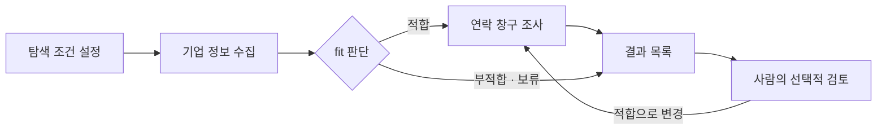

# 리스트업 데이터 스키마 및 API 명세 v0.1

- 작성일: 2026-09-24
- 상태: 구현 전 초안
- 목적: GrowthHackers SNU가 개입할 가능성과 가치가 있는 기업을 발견하고, 연락 창구를 확보한다.
- 범위: 탐색 설정, 기업 정보 수집, fit 판단, 사람의 판단 변경, 연락 창구 수집·판단, 결과 조회, 추가 조사.
- 제외: 제안 메시지 작성, 이메일·LinkedIn 발송, 답장 추적, 수주 관리.
- 이 문서는 새 워크플로우의 제안 계약이다. 기존 코드·API와의 호환성을 확인한 명세가 아니며 기존 구현을 변경하지 않는다.
- 데이터 구조는 논리 스키마이며, 각 구조를 반드시 독립 DB 테이블로 구현할 필요는 없다.

## 1. 합의한 흐름과 원칙



- **fit 기준:** 개입 가능성과 개입 가치.
- **사람의 판단 우선:** 시스템이 1차 판단하며, 사람은 모든 결과를 검토·변경할 수 있다. 시스템 재판단은 필요 없다.
- **추가 조사:** 정보가 부족할 때만 수행한다. 연락처가 없어도 fit 판단은 유지한다.

## 2. 공통 규약

### 2.1 데이터와 소유권

- `UUID`: UUID 문자열. 예시의 `_uuid` 문자열은 자리표시자다.
- `datetime`: UTC ISO 8601 문자열. 예: `2026-09-24T03:00:00Z`.
- `URL`: 절대 HTTP(S) URL.
- 이름·설명·근거 등 본문은 Unicode 문자열.
- `field?: T`: 응답 키 자체가 생략될 수 있음. `field: T | null`: 키는 존재하며 미확인은 null.
- 모든 리소스는 공통 `workspace_id: UUID`를 가진다. 인증 컨텍스트로 서버가 결정하며 생성 요청에서 받지 않는다.
- ID, 생성 시각, 실행 상태, 파생 상태, 버전은 별도 명시가 없으면 서버 관리 값이다.
- 다른 워크스페이스 리소스 참조는 허용하지 않는다. 인증 제공자와 실제 역할 체계는 구현 시 결정한다.
- `created_by`, `decided_by`는 인증된 사용자에서 결정하며 클라이언트가 임의 지정하지 않는다.

### 2.2 HTTP

- 기본 경로: `/api/v1`.
- JSON 요청·응답: `Content-Type: application/json`.
- 단건 응답: `{ "data": Resource }`.
- 목록 응답: `{ "data": Resource[], "page": { "next_cursor": string | null, "has_more": boolean } }`.
- 목록 공통 쿼리: `limit` 기본 20, 최대 100; `cursor`는 서버가 발급하는 불투명 문자열.
- 기본 정렬: `created_at DESC, id DESC`. 허용된 정렬 필드만 사용한다.
- 생성은 `201`, 비동기 요청 접수는 `202`, 조회·수정은 `200`.
- 비동기 작업은 `GET /tasks/{id}`로 조회한다. v0.1은 폴링을 기본으로 한다.

### 2.3 중복 요청과 동시 수정

- 작업 또는 이력을 생성하는 모든 POST에 `Idempotency-Key` 헤더를 요구한다.
- 같은 워크스페이스·경로·키·본문의 재요청은 동일 결과를 반환한다. 같은 키로 다른 본문을 보내면 `409 IDEMPOTENCY_CONFLICT`.
- 키 보관 기간은 최소 24시간으로 한다.
- 사람의 판단 변경 요청에는 `expected_revision`을 요구한다. 후보의 현재 `revision`과 다르면 `409 REVISION_CONFLICT`.
- 후보 revision은 현재 조사·판단 참조, 연락 상태 또는 그 밖의 사용자에게 보이는 후보 상태가 바뀔 때 증가한다.

## 3. 데이터 스키마

아래 타입의 모든 최상위 리소스에는 공통 `workspace_id`가 포함된다. 반복 표기는 생략한다.

### 3.1 SearchRun — 탐색 실행

```typescript
type SourceConfig = {
  key: string;                    // 실행 내 고유 키
  name: string;
  entry_urls: URL[];
  query: string | null;
};

type SearchFilters = {
  industries: string[];
  keywords: string[];
  regions: string[];
  company_stages: string[];
  excluded_company_ids: UUID[];
  additional_conditions: string | null;
};

type SearchLimits = {
  max_companies: number;           // 양의 정수, 고유 후보 수의 상한
  max_fit_followup_rounds: number; // 0 이상의 정수, 후보별 자동 보완 조사 횟수
  max_contact_search_rounds: number; // 1 이상의 정수, 후보별 최초 연락 조사 포함
};

type SearchRun = {
  id: UUID;
  source_policy: "selected_only" | "allow_supplementary";
  sources: SourceConfig[];         // 최소 1개
  filters: SearchFilters;
  limits: SearchLimits;
  status: "queued" | "running" | "completed" |
          "partially_completed" | "failed" | "cancelled";
  created_by: UUID;
  created_at: datetime;
  started_at: datetime | null;
  finished_at: datetime | null;
};
```

- 필터 배열이 비어 있으면 해당 조건으로 제한하지 않는다.
- `selected_only`는 지정 소스 범위에서만 수집한다. `allow_supplementary`는 공식 사이트 등 보완 출처를 허용한다.
- 소스 식별자에서 실제 검색 어댑터·허용 도메인으로 변환하는 설정은 서버에서 관리한다. 지원하지 않는 소스는 생성 시 거절한다.
- `max_companies`는 목표 확보 수를 보장하지 않는다.
- 실행 설정은 생성 후 변경하지 않는다. 다른 조건으로 탐색하려면 새 실행을 생성한다.
- `completed`: 자동 탐색 작업이 정상 종료됨. 부적합·보류·연락처 미발견은 정상 결과다.
- `partially_completed`: 일부 작업이 실패했으나 유효한 결과가 남음.
- `failed`: 실행을 진행하지 못했거나 유효한 결과 없이 필수 작업이 실패함.
- 탐색 종료 후 사람이 요청한 추가 작업은 원래 실행 상태를 다시 running으로 바꾸지 않는다. 작업 상태를 별도로 조회한다.

### 3.2 Company — 기업 식별 정보

```typescript
type Company = {
  id: UUID;
  name: string;
  legal_name: string | null;
  aliases: string[];
  website_url: URL | null;
  canonical_domain: string | null;
  created_at: datetime;
  updated_at: datetime;
};
```

기업은 여러 탐색에서 재사용한다. 이름·도메인은 중복 후보 확인에 사용하되 단독으로 기업 동일성을 확정하지 않는다. 자동 병합이 불확실하면 분리 보존한다. 수동 병합 API는 v0.1 범위 밖이다.

### 3.3 Evidence — 수집 근거

```typescript
type Evidence = {
  id: UUID;
  company_id: UUID;
  search_run_id: UUID | null;
  url: URL;
  source_name: string;
  source_type: "official" | "company_database" | "news" |
               "newsletter" | "linkedin" | "other";
  title: string | null;
  excerpt: string | null;
  published_at: datetime | null;
  retrieved_at: datetime;
};
```

근거는 수집 시점의 기록으로 보존한다. 추론 자체를 출처인 것처럼 저장하지 않는다. 같은 URL이라도 수집 시점·발췌 내용이 다를 수 있다.

### 3.4 CompanyResearch — 기업 조사 버전

```typescript
type ResearchClaim = {
  id: UUID;
  category: "product_service" | "target_customer" | "revenue_model" |
            "user_journey" | "operations" | "recent_change" | "public_challenge";
  content: string;
  basis: "reported_fact" | "inference";
  evidence_ids: UUID[];
};

type CompanyResearch = {
  id: UUID;
  company_id: UUID;
  search_run_id: UUID;
  claims: ResearchClaim[];
  missing_information: string[];
  created_at: datetime;
};
```

- `reported_fact`에는 출처가 최소 1개 필요하다. 이는 출처에 명시된 정보이며 진위의 완전한 보장을 뜻하지 않는다.
- 새 조사는 새 버전으로 저장한다. 현재 버전은 이전 정보를 포함한 통합 스냅샷으로 제공한다.
- 이전 판단은 당시 사용한 `research_id`를 계속 참조한다.

### 3.5 Candidate — 탐색별 기업 상태

```typescript
type FitVerdict = "fit" | "unfit" | "pending";
type ContactStatus = "not_started" | "searching" | "available" |
                     "needs_verification" | "not_found";

type Candidate = {
  id: UUID;
  search_run_id: UUID;
  company_id: UUID;
  discovery_evidence_ids: UUID[];
  current_research_id: UUID | null;
  latest_system_assessment_id: UUID | null;
  active_human_decision_id: UUID | null;
  effective_fit: FitVerdict | "not_assessed";
  contact_status: ContactStatus;
  revision: number;
  created_at: datetime;
  updated_at: datetime;
};
```

- `(search_run_id, company_id)`는 유일하다.
- `effective_fit`은 활성 사람 판단 → 최신 시스템 판단 → `not_assessed` 순서로 산출한다.
- 사람 판단 변경과 후속 작업 접수는 중복 없이 일관되게 처리한다.
- 사람 판단을 자동 판단으로 되돌리는 별도 기능은 v0.1에 포함하지 않는다. 사람이 다른 결론으로 다시 변경할 수 있다.

### 3.6 FitAssessment — 시스템 판단 이력

```typescript
type CriterionAssessment = {
  verdict: "supported" | "unsupported" | "unknown";
  rationale: string;
  evidence_ids: UUID[];
};

type InterventionAssessment = {
  id: UUID;
  area: string;
  feasibility: CriterionAssessment & {
    required_conditions: string[];
  };
  value: CriterionAssessment & {
    target_business_outcome: string;
  };
};

type InformationGap = {
  question: string;
  resolution_method: "public_research" | "company_confirmation";
};

type FitAssessment = {
  id: UUID;
  candidate_id: UUID;
  research_id: UUID;
  verdict: FitVerdict;
  summary: string;
  interventions: InterventionAssessment[];
  information_gaps: InformationGap[];
  criteria_version: string;
  model_version: string | null;
  created_at: datetime;
};
```

- `fit`: 적어도 하나의 동일한 개입 영역에서 가능성과 가치가 모두 supported여야 한다.
- `unfit`: 부적합 판단 이유를 설명한다. 단순히 정보가 부족한 경우는 pending으로 둔다.
- `pending`: 결론에 필요한 정보가 부족하다.
- 공개 정보로 판단한 fit은 컨택 가치에 대한 가설이며, 실제 계약·데이터 접근·실험 권한이 확정됐다는 의미가 아니다.
- `company_confirmation` 항목은 공개 검색의 반복 대상으로 삼지 않는다. 회사에 실제 문의하는 행위는 이번 범위 밖이다.

### 3.7 HumanFitDecision — 사람의 판단 이력

```typescript
type HumanFitDecision = {
  id: UUID;
  candidate_id: UUID;
  verdict: FitVerdict;
  reason: string | null;
  intervention_note: string | null;
  based_on_assessment_id: UUID | null;
  decided_by: UUID;
  created_at: datetime;
};
```

이유·새로운 관점 입력은 선택이다. 새 결정을 추가하고 후보의 활성 판단 참조를 바꾼다. 시스템의 검토·동의를 요구하지 않으며, 과거 이력을 수정하지 않는다.

### 3.8 CompanyPerson — 기업 관계자

```typescript
type CompanyPerson = {
  id: UUID;
  company_id: UUID;
  name: string;
  job_title: string | null;
  job_function: "executive" | "business_development" | "product" |
                "data" | "other" | "unknown";
  seniority: "c_level" | "manager" | "individual_contributor" | "unknown";
  employment_status: "current" | "former" | "unknown";
  employment_evidence_ids: UUID[];
  checked_at: datetime;
};
```

직무·의사결정권은 우선순위 판단에 사용하며 연락 가능성의 필수 조건이 아니다. 관계자의 동일 기업 재직 여부를 출처와 함께 확인한다.

### 3.9 ContactChannel — 연락 창구

```typescript
type ContactChannel = {
  id: UUID;
  company_id: UUID;
  person_id: UUID | null;
  type: "email" | "linkedin";
  value: string;
  owner_type: "person" | "team" | "company";
  discovery_method: "public_source" | "user_provided" | "inferred";
  ownership_status: "supported" | "uncertain" | "contradicted";
  validation_status: "not_checked" | "valid_format" | "invalid";
  reachability_status: "unknown" | "confirmed" | "unavailable";
  linkedin_methods: ("connection_request" | "direct_message" | "inmail")[];
  evidence_ids: UUID[];
  checked_at: datetime;
};
```

- `owner_type=person`이면 person_id가 필요하고 해당 관계자의 기업과 company_id가 일치해야 한다.
- team/company 창구는 person_id가 null이다.
- LinkedIn은 v0.1에서 개인 프로필만 다룬다. LinkedIn 창구는 owner_type=person이어야 한다.
- email은 이메일 형식, linkedin은 LinkedIn 프로필 URL 형식을 검사한다.
- email의 linkedin_methods는 항상 빈 배열이다. LinkedIn도 연락 방식 미확인이면 빈 배열이다.
- 프로필 발견·이메일 형식 검사를 실제 도달 확인으로 간주하지 않는다.
- reachability_status=confirmed는 별도 확인 근거가 있을 때만 허용한다. 이 API는 발송 검증을 수행하지 않는다.
- user_provided 값은 출처 구분을 위한 예약값이다. 수동 연락처 입력 API는 v0.1에 포함하지 않는다.

### 3.10 CandidateContact — 후보별 창구 평가

```typescript
type CandidateContact = {
  id: UUID;
  candidate_id: UUID;
  contact_channel_id: UUID;
  status: "usable" | "needs_verification" | "unusable";
  priority: "preferred" | "alternative";
  role_relevance: string | null;
  decision_authority: "supported" | "unknown";
  reason: string;
  checked_at: datetime;
};
```

- `(candidate_id, contact_channel_id)`는 유일하다. 후보와 창구의 기업은 일치해야 한다.
- usable은 소유 관계가 뒷받침되고 형식이 유효하며 알려진 사용 불가 사유가 없는 창구다. 실제 수신을 보장하지 않는다.
- 개인 창구는 현재 재직 근거가 필요하다. 재직 여부 미확인은 needs_verification, 전직자 창구는 해당 기업 대상으로 unusable 처리한다.
- 추정 이메일이나 소유자 미확인 프로필은 별도 근거로 확인되기 전까지 needs_verification이다.
- 직군·직급 선호에 맞지 않더라도 그 이유만으로 unusable 처리하지 않는다.

### 3.11 ResearchTask — 비동기 작업

```typescript
type ResearchTask = {
  id: UUID;
  search_run_id: UUID;
  candidate_id: UUID | null;
  parent_task_id: UUID | null;
  type: "company_discovery" | "company_research" | "fit_assessment" |
        "contact_research" | "contact_verification";
  trigger: "initial" | "auto_followup" | "human_request" | "fit_changed";
  requested_information: string[];
  followup_policy: "automatic" | "none";
  status: "queued" | "running" | "succeeded" | "failed" | "cancelled";
  attempt: number;
  result_refs: { resource_type: string; resource_id: UUID }[];
  error: { code: string; message: string; retryable: boolean } | null;
  created_at: datetime;
  started_at: datetime | null;
  finished_at: datetime | null;
};
```

- initial/auto_followup 작업은 automatic으로 필요한 다음 단계를 진행한다.
- 사람이 요청한 기업 정보 추가 조사는 none으로 실행한다. 사실 정보를 보완하고 사람이 확인하며 시스템 재판단을 자동 요구하지 않는다.
- 사람의 fit 변경으로 생성한 연락 조사는 automatic으로 연락 가능성 평가까지 수행한다.
- 실행 중인 동일 후보·유형의 동등한 작업은 중복 생성하지 않는다.
- retry는 같은 작업 ID의 attempt를 증가시킨다. 기술적 재시도와 내용 보완 조사 라운드는 구분한다.
- succeeded가 검색 성공을 뜻하며, 발견 결과는 비어 있을 수 있다. failed를 미발견으로 바꾸지 않는다.

## 4. 상태 산출과 후속 동작

### 4.1 후보별 연락 상태

아래 순서대로 첫 번째로 만족하는 상태를 적용한다.

| 조건 | contact_status |
| --- | --- |
| usable 창구가 1개 이상 | available |
| usable은 없고 연락 조사·검증 작업이 대기/실행 중 | searching |
| 활성 작업이 없고 needs_verification 창구가 1개 이상 | needs_verification |
| 정상 종료한 연락 조사가 있고 usable/needs_verification 창구가 없음 | not_found |
| 위 조건을 만족하지 않음 | not_started |

추가 조사가 실패하면 마지막 유효 결과는 유지한다. 최초 조사부터 실패한 경우 not_started와 실패 작업을 함께 표시한다. available 상태에서도 추가 작업이 실행 중일 수 있으므로 UI는 active_tasks를 함께 사용한다.

### 4.2 사람의 판단 변경

| 변경 결과 | 후속 동작 |
| --- | --- |
| fit, 기존 usable 창구 있음 | 기존 결과 재사용, 자동 조사 생략 |
| fit, 활성 연락 작업 있음 | 기존 작업 재사용 |
| fit, 그 외 | 연락 조사 접수. 자동 한도에 도달했으면 판단만 저장하고 미접수 사유 반환 |
| unfit 또는 pending | 대기 자동 후속 조사 취소, 실행 중 조사 중단 시도, 기존 결과 보존 |

사람의 명시적 추가 조사 요청은 자동 탐색 한도 소진 후에도 가능하다. 요청 1회당 조사 1회이며 기존 소스 제한을 따른다. 기술적 재시도는 이 횟수와 별도로 처리한다.

### 4.3 결과 화면 분류

- 적합·창구 확보: effective_fit=fit AND contact_status=available.
- 적합·창구 미확보: effective_fit=fit AND contact_status!=available. 내부에서 조사 중/검증 필요/미발견을 구분한다.
- 판단 보류: effective_fit=pending.
- 부적합: effective_fit=unfit.
- 전체 목록에는 아직 미판단인 not_assessed 후보도 표시한다.

## 5. API 목록

아래 API는 인증된 현재 워크스페이스 범위에서 동작한다. 읽기 요청에는 읽기 권한, 생성·변경 요청에는 쓰기 권한이 필요하다.

| Method | Path | 용도 | 성공 코드 |
| --- | --- | --- | --- |
| POST | /search-runs | 탐색 생성 및 시작 | 202 |
| GET | /search-runs | 탐색 목록 | 200 |
| GET | /search-runs/{id} | 조건·상태·집계 조회 | 200 |
| POST | /search-runs/{id}/cancel | 탐색 취소 | 202 |
| GET | /candidates | 후보 목록·필터 | 200 |
| GET | /candidates/{id} | 후보 상세 | 200 |
| GET | /candidates/{id}/fit-assessments | 시스템 판단 이력 | 200 |
| GET | /candidates/{id}/human-fit-decisions | 사람 판단 이력 | 200 |
| POST | /candidates/{id}/human-fit-decisions | 사람 판단 직접 변경 | 201 |
| GET | /candidates/{id}/contacts | 창구·관계자·평가 조회 | 200 |
| POST | /candidates/{id}/research-requests | 사실 정보·연락 창구 추가 조사 | 202 |
| GET | /companies/{id} | 기업 식별 정보 조회 | 200 |
| GET | /company-research/{id} | 특정 기업 조사 버전 조회 | 200 |
| GET | /evidence/{id} | 특정 근거 조회 | 200 |
| GET | /tasks | 작업 목록·진행·실패 조회 | 200 |
| GET | /tasks/{id} | 작업 조회 | 200 |
| POST | /tasks/{id}/retry | 재시도 가능한 실패 작업 재접수 | 202 |

수집 결과와 시스템 판단은 내부 작업자가 기록한다. 외부 클라이언트가 시스템 결과를 임의로 생성·수정하는 API는 제공하지 않는다.

## 6. 엔드포인트 상세

### 6.1 탐색 생성 및 조회

`POST /search-runs` 요청:

```json
{
  "source_policy": "allow_supplementary",
  "sources": [
    { "key": "google", "name": "Google", "entry_urls": [], "query": "신규 구독 서비스 출시 기업" }
  ],
  "filters": {
    "industries": [],
    "keywords": ["구독 서비스"],
    "regions": [],
    "company_stages": [],
    "excluded_company_ids": [],
    "additional_conditions": null
  },
  "limits": {
    "max_companies": 20,
    "max_fit_followup_rounds": 1,
    "max_contact_search_rounds": 2
  }
}
```

- 최상위 필드와 하위 구조는 모두 필수이며 null/빈 배열 허용 여부는 스키마를 따른다. 위 소스·횟수는 예시이며 확정 기본값이 아니다.
- 서버가 탐색 조건을 저장하고 최초 company_discovery 작업을 생성한다.
- 응답: `data: { search_run: SearchRun, initial_task: ResearchTask }`.
- `Location: /api/v1/search-runs/{id}` 헤더 반환.
- `GET /search-runs`: status 필터와 공통 페이지네이션. data 항목은 SearchRun.
- `GET /search-runs/{id}` 응답:

```typescript
type SearchRunDetail = {
  search_run: SearchRun;
  counts: {
    candidates: number;
    fit: number;
    unfit: number;
    pending: number;
    not_assessed: number;
    fit_with_available_contact: number;
    active_tasks: number;
    failed_tasks: number;
  };
};
```

집계는 현재 유효 판단을 기준으로 한다. 종료 후 사람의 변경으로 집계가 달라질 수 있다.

`POST /search-runs/{id}/cancel`:

- 본문 없음. 미종료 탐색의 대기 작업 취소, 실행 중 작업 중단 요청, 자동 후속 생성 중지.
- 기존 수집 정보 보존. 응답 data: SearchRun. cancelled 상태 재요청은 동일 상태 반환.
- completed/partially_completed/failed 실행에 대한 취소는 `409 INVALID_STATE`.
- 종료 후 사람이 시작한 추가 작업은 원래 탐색 취소 대상이 아니다.

### 6.2 후보 목록

`GET /candidates` 쿼리:

| 파라미터 | 타입 | 설명 |
| --- | --- | --- |
| search_run_id | UUID | 특정 실행 |
| company_id | UUID | 특정 기업 |
| effective_fit | enum | fit/unfit/pending/not_assessed |
| contact_status | enum | ContactStatus |
| decision_source | enum | system/human/none |
| q | string | 기업명·별칭 검색 |
| sort | enum | created_at_desc/updated_at_desc, 기본 created_at_desc |
| limit, cursor | 공통 | 페이지네이션 |

필터는 AND로 적용한다. 목록 항목:

```typescript
type CandidateListItem = {
  id: UUID;
  search_run_id: UUID;
  revision: number;
  company: Company;
  fit: {
    effective_verdict: FitVerdict | "not_assessed";
    decision_source: "system" | "human" | "none";
    system_verdict: FitVerdict | null;
    human_verdict: FitVerdict | null;
    summary: string | null;
  };
  contacts: {
    status: ContactStatus;
    usable_count: number;
    needs_verification_count: number;
  };
  active_tasks: ResearchTask[];
  latest_failed_task: ResearchTask | null;
  updated_at: datetime;
};
```

summary는 현재 적용하는 판단의 이유다. 사람 판단의 reason이 없으면 null로 반환하며, 시스템 이유를 사람 판단의 이유처럼 표시하지 않는다.

### 6.3 후보 상세 및 이력

`GET /candidates/{id}` 응답:

```typescript
type CandidateDetail = {
  candidate: Candidate;
  company: Company;
  current_research: CompanyResearch | null;
  latest_system_assessment: FitAssessment | null;
  active_human_decision: HumanFitDecision | null;
  evidence: Evidence[]; // 위 현재 정보 및 발견 근거가 참조하는 출처
  contact_counts: { usable: number; needs_verification: number; unusable: number };
  active_tasks: ResearchTask[];
  latest_failed_task: ResearchTask | null;
};
```

- 연락처 전체는 `/candidates/{id}/contacts`에서 조회한다.
- `/fit-assessments`: 공통 페이지네이션, 항목 FitAssessment.
- `/human-fit-decisions`: 공통 페이지네이션, 항목 HumanFitDecision.
- 과거 판단의 research_id와 evidence_ids는 각각 조사 버전·근거 단건 API로 조회할 수 있다.

### 6.4 사람의 판단 직접 변경

`POST /candidates/{id}/human-fit-decisions` 요청:

```json
{
  "expected_revision": 3,
  "verdict": "fit",
  "reason": "기존 판단에서 다루지 않은 온보딩 개선 가능성이 있음",
  "intervention_note": "가입 후 첫 사용까지의 이탈 구간에 실험 가능",
  "based_on_assessment_id": "assessment_uuid"
}
```

- expected_revision, verdict만 필수. 나머지는 생략 시 null.
- based_on_assessment_id가 있으면 같은 후보의 판단이어야 한다.
- 사람 판단을 즉시 적용하고 4.2의 후속 동작을 수행한다. 시스템 재판단을 생성하지 않는다.
- 응답:

```typescript
type HumanDecisionResponse = {
  decision: HumanFitDecision;
  candidate: Candidate;
  followup: {
    action: "task_created" | "task_reused" | "contacts_reused" | "none";
    task_id: UUID | null;
    reason: "fit_changed" | "existing_task" | "existing_contacts" |
            "automatic_limit_reached" | "not_fit";
  };
};
```

판단 저장 자체가 성공하면 후속 조사가 없어도 201이다. 자동 한도 도달은 판단 저장 실패가 아니다.

### 6.5 연락 창구 조회

`GET /candidates/{id}/contacts`:

- 쿼리: status(usable/needs_verification/unusable), type(email/linkedin), priority(preferred/alternative), limit, cursor.
- 각 항목:

```typescript
type CandidateContactItem = {
  evaluation: CandidateContact;
  channel: ContactChannel;
  person: CompanyPerson | null;
  evidence: Evidence[];
};
```

- 기본 정렬: preferred 우선, checked_at 내림차순, id 내림차순.
- LinkedIn 연락 방식이 미확인이어도 그 사실을 그대로 반환한다.

### 6.6 추가 조사 요청

`POST /candidates/{id}/research-requests` 요청:

```json
{
  "type": "company_research",
  "requested_information": ["현재 구독 상품의 수익 구조와 가격 정책 확인"]
}
```

- type: company_research/contact_research/contact_verification 중 하나, 필수.
- requested_information: 필수 문자열 배열. 최소 1개의 구체적 요청 필요.
- company_research: 모든 fit 상태에서 가능. 새 조사 버전을 생성하고 시스템 재판단은 자동 실행하지 않는다.
- contact_research/contact_verification: effective_fit=fit일 때 가능. 아니면 `409 FIT_REQUIRED`.
- contact_verification: 검증할 기존 창구가 있어야 한다. 없으면 `409 NO_CONTACT_TO_VERIFY`.
- 연락 조사 요청은 내부적으로 연락 가능성 평가까지 완료한다.
- 자동 한도 소진 후에도 명시적 요청 1회로 실행 가능하며 원래 source_policy를 유지한다.
- 동등한 작업이 이미 실행 중이면 기존 작업을 반환한다. 내용이 다른 동일 유형 작업과 충돌하면 `409 TASK_ALREADY_RUNNING`.
- 응답: `data: { task: ResearchTask, reused: boolean }`.
- `Location: /api/v1/tasks/{id}` 헤더 반환.

### 6.7 원천 정보 조회

- `GET /companies/{id}` → data: Company.
- `GET /company-research/{id}` → data: CompanyResearch.
- `GET /evidence/{id}` → data: Evidence.
- 접근할 수 없거나 존재하지 않는 리소스는 404로 응답한다.

### 6.8 작업 조회와 재시도

- `GET /tasks`: search_run_id, candidate_id, type, status 필터 및 공통 페이지네이션. 항목 ResearchTask.
- `GET /tasks/{id}`: data: ResearchTask.
- `POST /tasks/{id}/retry`: 본문 없음. failed AND error.retryable=true인 작업만 접수 가능.
- 재시도 시 현재 fit과 실행 취소 상태를 다시 확인한다. 부적합으로 변경된 후보의 자동 연락 조사나 취소된 실행의 자동 작업은 재개하지 않는다.
- 접수 성공: attempt 증가, status=queued, error=null, data: ResearchTask, HTTP 202.
- 재시도 불가 상태: `409 TASK_NOT_RETRYABLE`.
- 결과 저장은 중복에 안전해야 하며, 재시도로 동일 후보·동일 연락 창구가 중복 생성되지 않아야 한다.

## 7. 오류 응답

```json
{
  "error": {
    "code": "REVISION_CONFLICT",
    "message": "후보 정보가 변경되었습니다. 최신 정보를 확인한 뒤 다시 요청하세요.",
    "details": { "expected_revision": 3, "current_revision": 4 },
    "request_id": "request_uuid"
  }
}
```

| HTTP | 대표 code | 의미 |
| --- | --- | --- |
| 400 | INVALID_REQUEST | 잘못된 JSON·쿼리·필수 헤더 누락 |
| 401 | UNAUTHENTICATED | 인증 필요 |
| 403 | FORBIDDEN | 현재 워크스페이스 내 작업 권한 부족 |
| 404 | NOT_FOUND | 리소스 없음 또는 접근 가능한 범위 밖 |
| 409 | REVISION_CONFLICT | 동시 변경 충돌 |
| 409 | IDEMPOTENCY_CONFLICT | 같은 요청 키에 다른 본문 |
| 409 | INVALID_STATE / FIT_REQUIRED / NO_CONTACT_TO_VERIFY | 현재 상태에서 허용되지 않음 |
| 409 | TASK_ALREADY_RUNNING / TASK_NOT_RETRYABLE | 작업 충돌 또는 재시도 불가 |
| 422 | VALIDATION_ERROR / UNSUPPORTED_SOURCE | 필드 제약·지원 소스 위반 |
| 429 | RATE_LIMITED | 요청 한도 초과, Retry-After 제공 |
| 500 | INTERNAL_ERROR | 서버 내부 오류 |
| 503 | SERVICE_UNAVAILABLE | 작업 접수 등 서비스 일시 불가 |

접수 후 외부 검색 서비스에 오류가 발생하면 HTTP 202를 뒤늦게 바꾸지 않고 ResearchTask.error에 기록한다. 사용자용 오류에 인증 정보나 내부 비밀값을 노출하지 않는다.

## 8. 구현 시 확인할 대표 시나리오

1. 같은 기업을 여러 소스에서 발견해도 실행 내 후보는 하나이고 발견 근거는 합쳐진다.
2. 적합 후보만 자동 연락 조사로 넘어가며, 부적합·보류도 목록과 근거를 조회할 수 있다.
3. 공개 정보 부족에 따른 자동 보완 조사는 한도 내에서만 반복된다.
4. 사람이 부적합을 적합으로 변경하면 시스템 재판단 없이 연락 조사가 접수된다.
5. 사람 판단 후 시스템 작업이 늦게 완료되어도 사람의 판단이 유지된다.
6. 사람이 사실 정보만 추가 조사하면 fit이 자동으로 변경되지 않는다.
7. 연락처 미발견과 검색 작업 실패가 서로 다른 결과로 표현된다.
8. LinkedIn 프로필 확보, 실제 메시지 방식 확인, 이메일 수신 확인이 혼동되지 않는다.
9. 같은 POST 재전송으로 탐색·판단 이력·작업이 중복 생성되지 않는다.
10. 동시 사용자 수정은 revision 충돌로 처리되고 과거 이력은 보존된다.
11. 판단 지침 변경이 기존 시스템 판단 이력과 당시 criteria_version을 바꾸지 않는다.
12. 한 워크스페이스 사용자가 다른 워크스페이스 리소스를 조회·참조할 수 없다.

## 9. 추후 확정할 구현 항목

- 검색 소스별 실제 연동 방식과 지원 범위, 어댑터·허용 도메인 매핑.
- fit 판단 지침의 구체적인 예시와 criteria_version 관리 방식.
- 검색·재시도 기본 한도와 비용 제한.
- 연락 정보의 재확인 주기와 오래된 정보 표시 정책.
- 인증 제공자와 사용자 역할별 권한.
- 기존 시스템과의 연결 방식 및 필요한 데이터 이전.

위 항목은 구현 전 확인할 사항이다. 현재 문서의 필드·상태·엔드포인트는 v0.1 제안이며, 실제 기업을 대상으로 검증한 뒤 변경할 수 있다.
